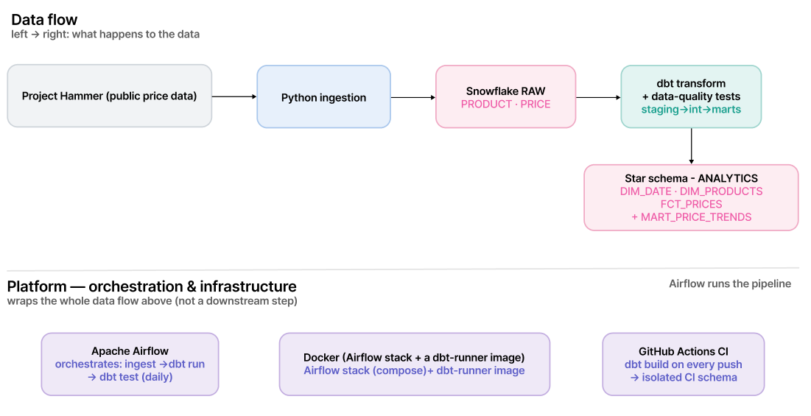
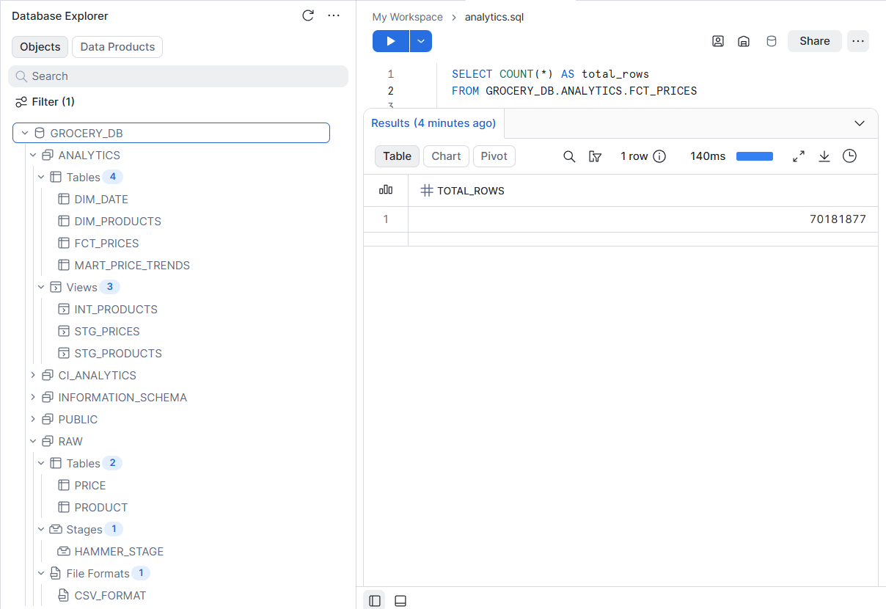
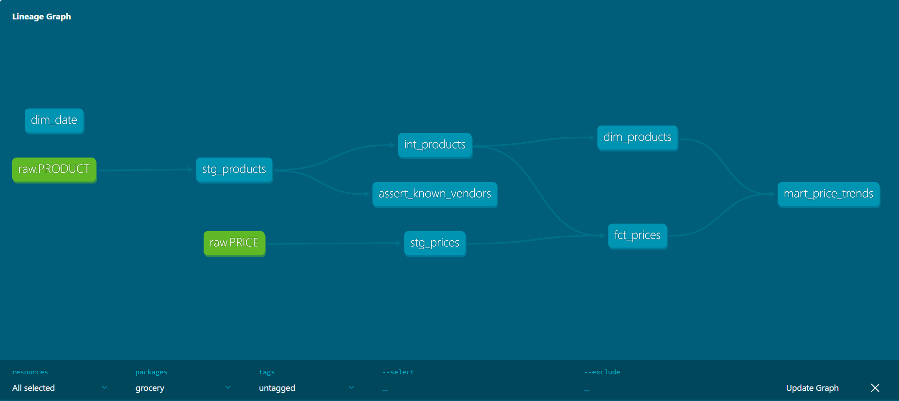
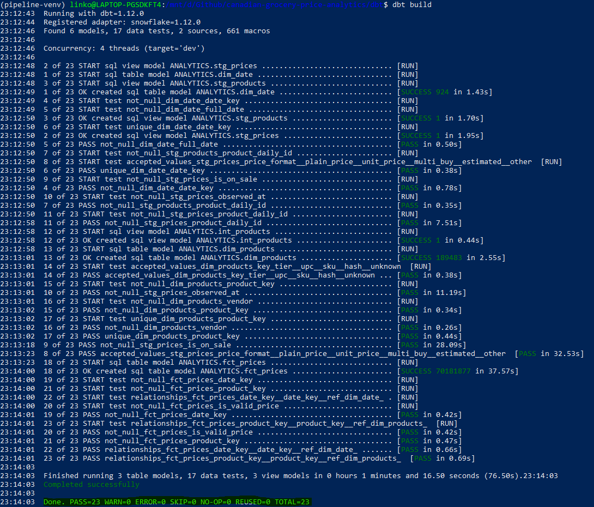
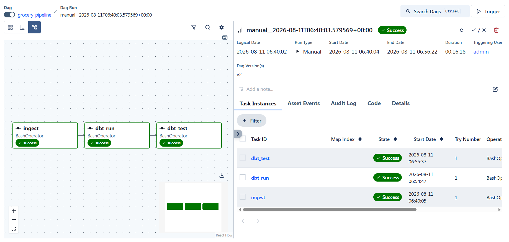
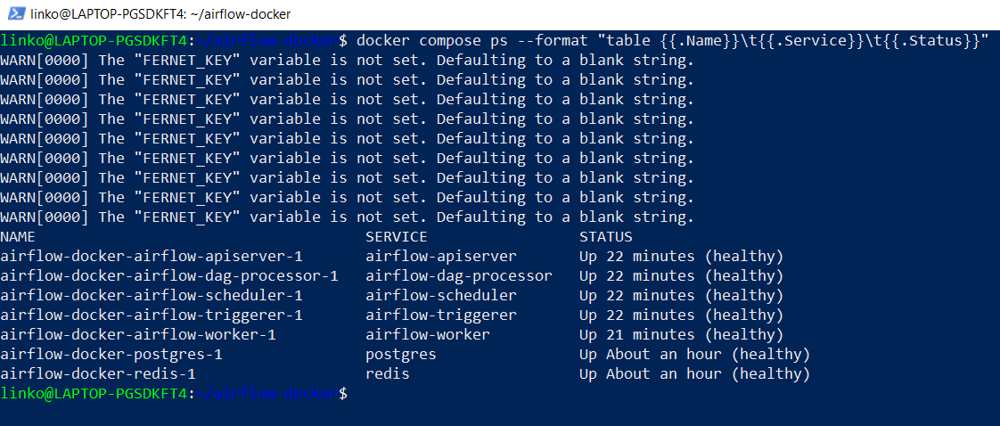
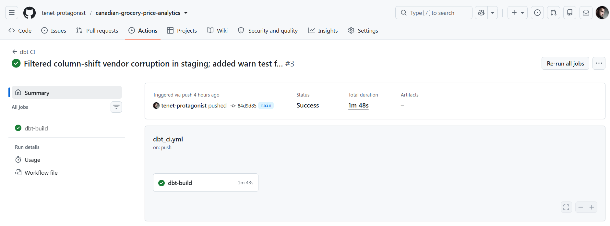
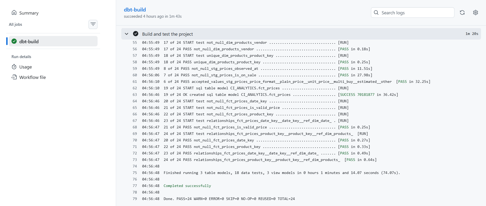

<p align="center">

 &nbsp;&nbsp;&nbsp;

 &nbsp;&nbsp;&nbsp;


</p>

# Canadian Grocery Price Analytics — End-to-End ELT Pipeline

An end-to-end data engineering project that ingests **~70 million** historical
grocery-price observations from eight major Canadian retailers, models them into a
tested **star schema** in Snowflake, orchestrates the workflow with Apache Airflow,
containerises it with Docker, and validates every change in CI.

**Stack:** SQL | Python | Snowflake | dbt | Apache Airflow | Docker | GitHub Actions

---

## Table of contents

- [Overview](#overview)
- [Architecture](#architecture)
- [Tech stack](#tech-stack)
- [Data source](#data-source)
- [The data model](#the-data-model)
- [Repository structure](#repository-structure)
- [How to run](#how-to-run)
- [Pipeline in action](#pipeline-in-action)
- [Engineering notes & lessons](#engineering-notes--lessons)
- [Documentation](#documentation)

---

## Overview

This project turns messy, publicly-scraped grocery prices into a clean, tested,
queryable analytics layer — using the full modern data stack.

**What it demonstrates:**

- **ELT, not ETL** — raw data lands in Snowflake first, then dbt transforms it
  in-warehouse, where compute is cheap and every model is version-controlled.
- **Dimensional modelling** — a star schema with a fact table and conformed dimensions.
- **Identity resolution** — the source regenerates product IDs daily; a tiered
  stable key (UPC → vendor+SKU → hash) collapses ~305k daily IDs into ~190k products.
- **Data quality** — dbt tests for uniqueness, not-null, referential integrity and
  accepted values, plus a custom warn-level test for unexpected vendors.
- **Orchestration, containerisation, CI** — the full production-shaped toolchain.

---

## Architecture

The pipeline (top) moves data left-to-right; the platform (bottom) orchestrates and
wraps it.

<!-- 📸 docs/architecture.png — your two-layer diagram (data-flow spine on top, platform band underneath) -->


---

## Tech stack

| Layer | Tool |
|---|---|
| Query language | SQL (window functions, aggregations, CTEs) |
| Ingestion | Python (requests, pandas, snowflake-connector) |
| Warehouse | Snowflake |
| Transformation | dbt (dbt-core + dbt-snowflake) |
| Orchestration | Apache Airflow |
| Containerisation | Docker / Docker Compose |
| CI | GitHub Actions |

---

## Data source

[**Project Hammer**](https://jacobfilipp.com/hammer/) by Jacob Filipp — a public
database of historical grocery prices scraped from eight Canadian grocers:
Loblaws, No Frills, Metro, Walmart Canada, Voila, T&T, Galleria, and Save-On-Foods.
Data runs from February 2024 and updates daily.

> Publicly scraped price data *about* these retailers, not an official corporate
> release. All credit for data collection goes to Project Hammer.

---

## The data model

A classic star schema in the `ANALYTICS` schema:

- **`FCT_PRICES`** — one row per price observation (~70M rows). Foreign keys to both
  dimensions, measures (`current_price`, `old_price`, `is_on_sale`), and an
  `is_valid_price` flag (plain-format prices above zero).
- **`DIM_PRODUCTS`** — one row per resolved product (~190k), with a tiered stable key
  and a `upc_normalized` attribute for cross-vendor matching. Includes an `unknown`
  member so orphan facts retain referential integrity.
- **`DIM_DATE`** — a calendar dimension generated from a date spine.
- **`MART_PRICE_TRENDS`** — a small pre-aggregated mart (vendor × month: median /
  average price, % on sale). Heavy aggregation is done once in the warehouse so a BI
  tool can read a compact summary instead of scanning 70M rows.

<!-- docs/snowflake_ingestion.png -->

<div align="center"><i>The `ANALYTICS` schema in Snowflake — dimensions, fact, and the aggregate mart. `FCT_PRICES` holds 70,181,877 rows</i></div>

### Key modelling decision: identity resolution

The source assigns product IDs that **regenerate daily**, so the same product has
different IDs on different days. A naive join fragments one product into many. The
`int_products` model resolves a **stable identity** per product using a tiered key:

1. `UPC` (zero-padded to 13 digits) where present — also enables cross-vendor matching
2. `vendor + SKU` as a fallback (within-vendor identity, ~90% coverage)
3. a hash of `vendor + product_name + units` as a last resort

This collapses ~305k daily IDs into ~190k products with 100% key coverage. The
dimension grain is **one row per (vendor, product)**: vendor is part of identity
because per-vendor price tracking needs it and store brands are vendor-exclusive,
while cross-vendor comparison happens via the `upc_normalized` attribute.

<!-- 📸 docs/dbt_graph.png -->

<div align="center"><i>dbt lineage: raw sources → staging → intermediate → dimensions/fact → aggregate mart, with the `assert_known_vendors` test branching off staging</i></div>

---

## Repository structure

```
├── ingestion/ # Python: download + load Project Hammer into RAW
│ └── load_to_snowflake.py
├── snowflake/ # bootstrap SQL (warehouse, database, schema, grants)
│ ├── bootstrap.sql
│ ├── grants.sql
├── dbt/
│ ├── models/
│ │ ├── staging/ # clean + classify raw data (views)
│ │ ├── intermediate/ # int_products: tiered stable product key
│ │ └── marts/ # dim_date, dim_products, fct_prices, mart_price_trends
│ ├── tests/ # singular tests (e.g. assert_known_vendors)
│ ├── dbt_project.yml
│ ├── packages.yml
│ └── profiles.yml
├── airflow/
│ └── dags/grocery_pipeline.py # ingest → dbt_run → dbt_test
├── docker/
│ ├── Dockerfile # custom dbt-runner image
│ ├── requirements.txt
│ └── docker-compose.yaml # Airflow stack (official reference file)
├── .github/workflows/
│ └── dbt_ci.yml # runs dbt build against an isolated CI schema
├── requirements.txt
└── README.md
```

---

## How to run

### 1. Prerequisites
- A Snowflake account
- Python 3.12+
- (Optional) Docker Desktop for the containerised paths

### 2. Configure credentials
Fill in your Snowflake connection (`.env`):

```
SNOWFLAKE_ACCOUNT=...
SNOWFLAKE_USER=...
SNOWFLAKE_PASSWORD=...
SNOWFLAKE_ROLE=SYSADMIN
SNOWFLAKE_WAREHOUSE=GROCERY_WH
SNOWFLAKE_DATABASE=GROCERY_DB
SNOWFLAKE_SCHEMA=RAW
```

### 3. Bootstrap Snowflake
Run `snowflake/bootstrap.sql` (creates the warehouse, database, and `RAW` schema).

### 4. Ingest
```bash
pip install -r requirements.txt
python ingestion/load_to_snowflake.py
```

### 5. Transform + test with dbt
```bash
cd dbt
dbt deps
dbt build   # builds staging + marts and runs all tests
```

### 6. Orchestrate with Airflow
```bash
export AIRFLOW_HOME=~/airflow
airflow standalone
# or the containerised stack:  cd docker && docker compose up -d
```
The `grocery_pipeline` DAG runs `ingest → dbt_run → dbt_test` on a daily schedule.

### 7. Run in Docker (the dbt-runner image)
```bash
docker build -f docker/Dockerfile -t grocery-dbt .
docker run --rm --env-file .env grocery-dbt   # dbt build inside a container
docker run --rm --env-file .env grocery-dbt test   # dbt test
```

### 8. CI
`.github/workflows/dbt_ci.yml` runs `dbt build` against an isolated `CI_ANALYTICS`
schema on every push and pull request. Snowflake credentials are stored as GitHub
encrypted secrets (never committed).

---

## Pipeline in action

**dbt — all models built and tested:**

<!-- 📸 screenshots/dbt_build_success.png -->

<div align="center"><i>`dbt build` finishing green — 6 models and 17 tests pass (`PASS=23, ERROR=0`)</i></div><br><br>

**Airflow — the orchestrated DAG:**

<!-- 📸 docs/airflow_success_graph_crop.png -->

<div align="center"><i>The `grocery_pipeline` DAG: `ingest → dbt_run → dbt_test`, all tasks successful, with run details</i></div><br><br>

**Docker — the Airflow stack running as containers:**

<!-- 📸 docs/docker_success_cut.png -->

<div align="center"><i>`docker compose ps` — the multi-container Airflow stack, all services `Up (healthy)`. The dbt pipeline also runs as a custom `grocery-dbt` image (see `logs/docker/docker_dbt_run.log`)</i></div><br><br>

**CI — automated checks on every push:**

<!-- 📸 docs/ci_workflow_graph.png -->

<div align="center"><i>GitHub Actions `dbt CI` workflow succeeding on push (1m 48s)</i></div><br><br>

<!-- 📸 docs/ci_workflow_log.png -->

<div align="center"><i>CI builds into the isolated `CI_ANALYTICS` schema, so tests run on real Snowflake without touching production data (`PASS=24`)</i></div>

---

## Engineering notes & lessons

- **Full-refresh over incremental for this source.** An early incremental design
  caused referential drift: facts accumulated two years of history while the product
  dimension was overwritten each run, so historical joins silently collapsed from
  ~100% to ~2% — surfacing as ~68M rows joining to "unknown". Because Project Hammer
  publishes a complete consistent snapshot each day, both tables are full-refreshed so
  product and price always align. Caught via a data-quality check, diagnosed with a
  match-rate query, and fixed by aligning the load strategy.
- **Mixed price formats.** The price column mixes plain prices, unit prices
  (`2.99/lb`), multi-buys (`4/$5.00`), and estimates. Each row is classified by a
  `price_format` label; the dominant plain case (~98%) is parsed to a decimal and the
  rest are flagged rather than dropped.
- **Referential integrity via an "unknown" member.** Orphan facts point to a single
  sentinel row in `DIM_PRODUCTS` rather than carrying null foreign keys or being
  dropped — so relationship tests pass and no rows are lost.
- **Column-shift corruption.** A few source rows have a URL or timestamp in the vendor
  column (a CSV misalignment). These are filtered *by shape* in staging (not by a
  brittle hardcoded whitelist), and a warn-level test flags any future unexpected
  vendor — filters hide problems, tests surface them.
- **Tests where they're meaningful.** `unique` / `relationships` tests live on the
  marts once a stable surrogate key exists — not on the raw daily ID, where they would
  fail for reasons that aren't real errors.

> **CI, not CD.** This project has Continuous Integration (validate every change in an
> isolated schema). It intentionally has no separate CD step, because in this
> architecture the orchestrator (Airflow) owns running the validated pipeline against
> production on a schedule — keeping "deploy to prod" out of the push-triggered CI.

---

*Data courtesy of [Project Hammer](https://jacobfilipp.com/hammer/).*
